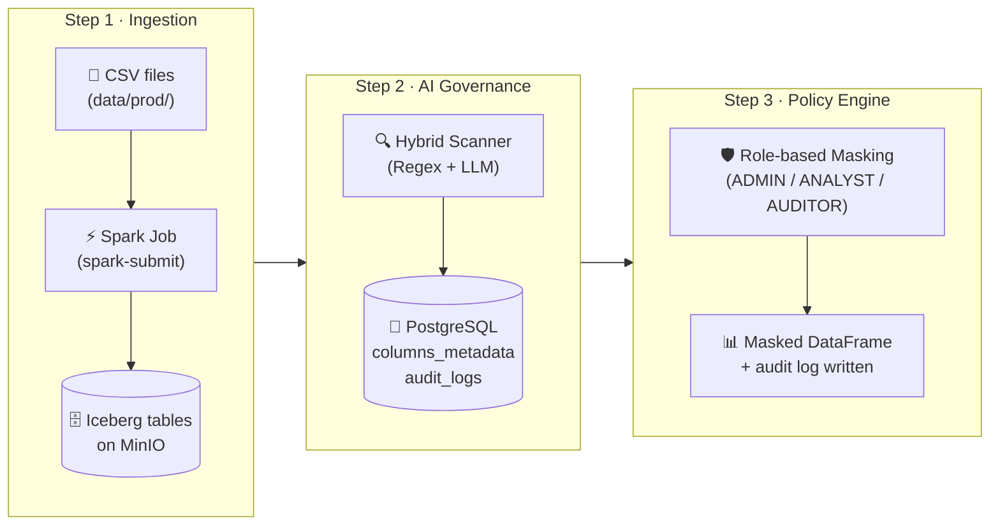

# LLM PII Governance Engine

---

<div align="center">

**An AI-powered data governance platform that automatically detects, classifies, and enforces access policies on Personally Identifiable Information (PII) stored in a lakehouse.**

---

[](https://www.python.org/)
[](https://spark.apache.org/)
[](https://iceberg.apache.org/)
[](https://min.io/)
[](https://www.postgresql.org/)
[](https://www.docker.com/)
[](https://grafana.com/)

[Project Overview](#-project-overview) •
[System Architecture](#-system-architecture) •
[Tech Stack](#-tech-stack) •
[Quick Start](#-quick-start) •
[Folder Structure](#-folder-structure) •
[Testing](#-testing)

</div>

---

## 📖 Project Overview

The **LLM PII Governance Engine** is an end-to-end data governance system built for the lakehouse era. It solves a critical enterprise problem: *how do you know which columns in your data lake contain sensitive personal information, and how do you enforce access control on them automatically?*

The platform operates as a three-stage pipeline:

1. **Ingestion** — Loads raw CSV data into an Apache Iceberg lakehouse on MinIO using Apache Spark.
2. **AI Governance** — Scans each Iceberg table using a **Hybrid AI Scanner** (Regex + LLM) to classify PII columns, then persists the metadata to PostgreSQL.
3. **Policy Engine** — Reads the governance metadata and dynamically applies masking rules (Hash, Redact, Nullify, Partial mask) to data at query-time, based on the requester's role.

### Core Objectives:
* **Automated PII Discovery:** No manual cataloguing — the system scans data automatically using regex heuristics and LLM reasoning.
* **Hybrid Detection:** Combines pattern-based Regex scanning (fast, high-throughput) with LLM semantic understanding (accurate, context-aware) and arbitrates the best result.
* **Role-Based Data Masking:** Enforces fine-grained column-level masking policies based on user roles (`ADMIN`, `ANALYST`, `AUDITOR`).
* **Full Audit Trail:** Every governance scan and every data access is logged for compliance.

---

## ✨ Platform Features

* **Hybrid PII Scanner:** Regex pre-screening identifies pattern-based PII (CCCD, phone, email). LLM then confirms and enriches results with semantic understanding (name, address, salary, DOB).

* **Confidence-Based Arbitration:** Regex and LLM outputs are merged using a configurable confidence threshold. The system selects the highest-confidence, highest-severity tag.

* **Dynamic Column-Level Masking:** The Policy Engine reads metadata from PostgreSQL and applies transformations (SHA-256 hash, `REDACTED`, `NULL`, partial mask) directly on Spark DataFrames at read-time — no data is permanently modified.

* **Role-Based Access Control:** Three built-in roles with differentiated masking rules:
  * `ADMIN` — Full clear-text access.
  * `ANALYST` — Partial masking on medium-sensitivity fields, hash on high-sensitivity.
  * `AUDITOR` — Redacted/nullified on high-sensitivity fields.

* **Apache Iceberg Lakehouse:** Data is stored as Iceberg tables on MinIO, enabling ACID transactions, time-travel, and schema evolution.

* **Comprehensive Audit Logging:** Governance scans (`governance_audit_logs`) and policy engine accesses (`policy_engine_audit_logs`) are both persisted to PostgreSQL.

* **Grafana Monitoring:** Pre-configured dashboards for observing governance results and access patterns.

---

## 🛠 Tech Stack

| Category | Technologies |
| :--- | :--- |
| **Languages** |   |
| **Compute** |  |
| **Lakehouse** |   |
| **AI / LLM** |   |
| **Metadata Store** |  |
| **Monitoring** |  |
| **Infrastructure** |  |

---

## 🚀 Quick Start

### Prerequisites

- **OS:** Linux
- **Python:** 3.10+
- **Tools:** Docker & Docker Compose

### 1. Clone and configure environment

```bash
git clone <repo-url>
cd llm-pii-governance-engine
cp .env.example .env
```

Edit `.env` and fill in your secrets:

```env
POSTGRES_PASSWORD=admin
MINIO_SECRET_KEY=minio123
DEEPSEEK_API_KEY=<your_deepseek_key>
OPENAPI_API_KEY=<your_openai_key>   # Optional, if using OpenAI
```

### 2. Install Python dependencies

```bash
pip install -r requirements.txt
```

### 3. Start infrastructure

```bash
docker compose -f docker_compose_base.yml up -d
```

This starts: **MinIO** (+ bucket init), **PostgreSQL**, **Spark Master**, **Spark Worker**.

> ⚠️ **Data folder not on Git.** You must create the `data/` folder manually and populate it before running ingestion.
>
> **Required structure:**
> ```
> data/
> └── prod/
>     ├── citizen_info.csv              # file name = table name in Iceberg
>     ├── hr_employees.csv
>     ├── medical_records.csv
>     ├── administrative_records.csv
>     └── metadata/
>         ├── citizen_info_metadata.json
>         ├── hr_employees_metadata.json
>         ├── medical_records_metadata.json
>         └── administrative_records_metadata.json
> ```
>
> Each `metadata/<table_name>_metadata.json` file contains the ground-truth column schema (column names + sensitivity tags), used by the test suite for evaluation.
>
> **To generate synthetic data automatically**, use the built-in generator:
> ```bash
> python -m src.modules.ingestion.generator
> ```
> This generates all CSV files and their corresponding `metadata/` JSON files in `data/prod/`. See [`generator.py`](./src/modules/ingestion/generator.py) for reference on adding new tables or custom schemas.
>
> **To point to a different data directory**, update `csv_folder` in `src/config/app_config.yml`:
> ```yaml
> spark:
>   csv_folder: "/app/data/prod/*.csv"   # ← change this path
> ```

### 4. Run Step 1 — Ingestion (load CSVs to MinIO Iceberg)

```bash
python -m src.modules.ingestion.ingestion_execute
```

> Submits a Spark job inside the `spark-master` container. CSVs in `data/prod/` are loaded into Iceberg tables on MinIO.  
> *See details:* [Ingestion Module](./src/modules/ingestion/README.md)

### 5. Run Step 2 — AI Governance (scan & write metadata to Postgres)

```bash
python -m src.modules.ai_governance.ai_governance_main
```

> Scans all Iceberg tables using the Hybrid AI Scanner and writes PII metadata to PostgreSQL.  
> To scan a specific table: set `target_table="<table_name>"` in the script's `__main__` block.  
> *See details:* [AI Governance Module](./src/modules/ai_governance/README.md)

### 6. Run Step 3 — Policy Engine (role-based masked data access)

```bash
python -m src.modules.policy_engine.policy_engine_main
```

> Reads governance metadata from Postgres and returns dynamically masked Spark DataFrames based on the user's role.  
> Edit the `__main__` block to change `test_table` and `analyst_role`.  
> *See details:* [Policy Engine Module](./src/modules/policy_engine/README.md)

---

## 📂 Folder Structure

```text
llm-pii-governance-engine/
├── data/                         # ⚠️ Not on Git — create manually
│   └── prod/
│       ├── <table_name>.csv      # CSV file name = Iceberg table name
│       └── metadata/
│           └── <table_name>_metadata.json  # Ground-truth schema for testing
├── deployment/
│   └── docker/                   # Additional Docker configurations
├── infra/
│   └── grafana/                  # Grafana provisioning (dashboards, datasources)
├── local/                        # Local dev utilities (postgres init scripts, etc.)
├── outputs/                      # Generated outputs (logs, scan reports)
├── src/
│   ├── config/                   # App config (app_config.yml, loader, logging)
│   ├── core/                     # Shared infra → see src/core/README.md
│   │   ├── dtos/                 # Enums and data models
│   │   ├── postgres/             # PostgresClient wrapper
│   │   └── spark/                # SparkSession builder (Iceberg + JDBC)
│   ├── llm/                      # LLM abstraction layer → see src/llm/README.md
│   ├── modules/
│   │   ├── ingestion/            # Step 1: CSV → MinIO Iceberg
│   │   ├── ai_governance/        # Step 2: PII scan → PostgreSQL metadata
│   │   └── policy_engine/        # Step 3: Role-based masked data access
│   └── test/                     # Test suites → see src/test/README.md
│       ├── e2e/                  # End-to-end scoring tests
│       ├── scanner_isolation/    # Unit tests for regex & LLM scanners
│       ├── policy_engine/        # Unit & compliance tests for masking
│       └── performance/          # Latency & throughput benchmarks
├── docker_compose_base.yml       # Core infrastructure (MinIO, Postgres, Spark)
├── docker_compose_spark_custom.yml
├── Dockerfile_spark_custom
├── requirements.txt
└── .env                          # Environment secrets (not on Git)
```

---

## ⚙️ System Architecture

### Pipeline Overview



### 1. Ingestion

* Triggered via `ingestion_execute.py`, which invokes `spark-submit` inside the `spark-master` Docker container.
* `ingestion_main.py` runs inside Spark and uses `SparkLoader` to read CSV files and write them as **Apache Iceberg** tables to MinIO.
* *See details:* [Ingestion](./src/modules/ingestion/README.md)

### 2. AI Governance

* Samples rows from each Iceberg table using `IcebergTableSampler`.
* **Regex Scanner** runs pattern matching against known PII patterns (CCCD, phone, email, health insurance ID) and calculates a confidence score per column.
* **LLM Scanner** receives a structured JSON prompt containing column names, sample data, and regex pre-analysis. The LLM returns a semantic classification with sensitivity tags and reasoning. Provider abstraction handled by the [LLM module](./src/llm/README.md).
* **Arbitration:** The two outputs are merged. The final tag is the highest-confidence, highest-severity result above the configured threshold.
* Results are written to `columns_metadata` and `governance_audit_logs` in PostgreSQL.
* *See details:* [AI Governance](./src/modules/ai_governance/README.md)

### 3. Policy Engine

* Reads masking policies from `access_policies` table in PostgreSQL (keyed by `user_role` × `sensitivity_level`).
* Loads the target Iceberg table as a Spark DataFrame.
* Applies column-level masking transformations (`DataMasker`) in a single Spark `.select()` pass for efficiency.
* Returns the secured DataFrame to the caller.
* Writes access audit log to `policy_engine_audit_logs`.
* *See details:* [Policy Engine](./src/modules/policy_engine/README.md)

### Shared Infrastructure

* **[Core module](./src/core/README.md)** — Provides `PostgresClient`, `SparkSession` builder, and all shared Pydantic models / enums used across the pipeline.
* **[LLM module](./src/llm/README.md)** — Provider-agnostic LLM abstraction (`LLMFactory`, `BaseLLMProvider`). Supports OpenAI and DeepSeek; extensible to any OpenAI-compatible API.

---

## 🧪 Testing

Tests are organized by concern under `src/test/`. Run with `pytest` from the project root.

```bash
# All tests
pytest src/test/

# Specific suite
pytest src/test/scanner_isolation/    # Unit tests: Regex & LLM scanners
pytest src/test/policy_engine/        # Masking compliance & dynamic update tests
pytest src/test/e2e/                  # End-to-end pipeline scoring
pytest src/test/performance/          # Latency benchmarks
```

*See details:* [Test Suite](./src/test/README.md)

---

## 📊 Monitoring (Grafana)

Grafana is provisioned automatically via `infra/grafana/provisioning/`.

| Service | URL | Default Credentials |
| :--- | :--- | :--- |
| Grafana | `http://localhost:3000` | `admin / admin` |
| MinIO Console | `http://localhost:9001` | `minio / minio123` |
| Spark UI | `http://localhost:8080` | — |
| PostgreSQL | `localhost:5432` | `admin / admin` |
