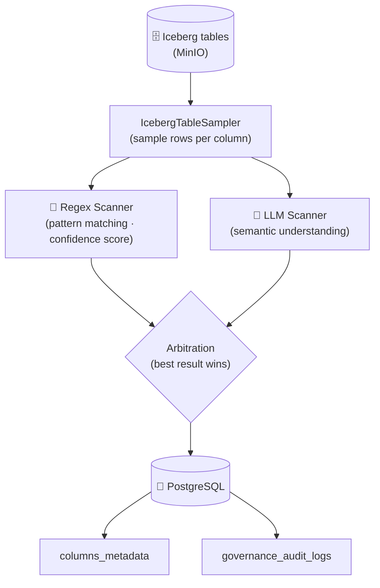

# AI Governance Module

This module is responsible for **Step 2** of the governance pipeline: scanning each Iceberg table to automatically detect and classify PII columns, then persisting the governance metadata to PostgreSQL.

---

## 🧱 High-Level Flow



---

## 📂 Module Structure

```text
ai_governance/
├── ai_governance_main.py     # Entry point — orchestrates the full scan pipeline
├── pipeline.py               # AIGovernancePipeline: main scan logic per table
├── table_sampler.py          # IcebergTableSampler: reads samples from Iceberg tables
├── regex_scanner.py          # Pattern-based PII detection with confidence scoring
├── llm_scanner.py            # LLM-based semantic PII detection
├── governance_repository.py  # DB writes: columns_metadata & audit logs
├── utils.py                  # Payload builders, arbitration logic, helpers
└── __init__.py
```

---

## ⚙️ Core Concepts

### Hybrid PII Scanner

The module uses a **two-stage, hybrid detection** approach per column:

#### Stage 1 — Regex Scanner (`regex_scanner.py`)

- Applies predefined regex patterns against a large sample of rows (default: 200 samples).
- Supported patterns: **CCCD/Resident ID**, **Phone number**, **Email**, **Health Insurance ID**.
- Calculates a **confidence score** per tag: `matched_rows / total_samples`.
- Tags above the confidence threshold (`0.70` by default) are flagged as `SUCCESS`; others are `UNDETERMINED`.

#### Stage 2 — LLM Scanner (`llm_scanner.py`)

- Receives a structured JSON prompt containing column names, small sample data (default: 5 rows), and the regex pre-analysis result.
- The LLM returns a structured response with:
  - `sensitivity_tag` (e.g., `NAME`, `ADDRESS`, `SALARY`, `DOB`)
  - `sensitivity_level` (`HIGH`, `MEDIUM`, `LOW`, `NONE`)
  - `confidence_score`
  - `reasoning`
- Supports OpenAI and DeepSeek providers via the `LLMFactory`.

#### Arbitration (`utils.py` → `arbitrate_hybrid_results`)

The two outputs are merged using the following logic:
- If the regex result is `SUCCESS` (high confidence) → **use regex result**.
- If the regex is `UNDETERMINED` and the LLM detected PII → **use LLM result**.
- If both detected PII but differ → **prefer the regex result** (deterministic pattern match).
- If neither detected PII → **tag as `NONE`**.

The final `DetectionReason` is recorded for full traceability.

---

## 🗄️ Data Written to PostgreSQL

| Table | What is stored |
| :--- | :--- |
| `tables_metadata` | Registered table name, scan timestamp |
| `columns_metadata` | Column name, `sensitivity_tag`, `sensitivity_level`, `detection_method`, `confidence_score` |
| `governance_audit_logs` | Full scan audit record per column including reasoning and raw scores |

---

## 🚀 Running the Module

```bash
# Scan all Iceberg tables
python -m src.modules.ai_governance.ai_governance_main
```

To scan a **specific table**, edit the `__main__` block in `ai_governance_main.py`:

```python
if __name__ == "__main__":
    ai_governance_main(target_table="citizen_info")
```

---

## ⚙️ Configuration

Key governance parameters in `src/config/app_config.yml`:

```yaml
governance:
  confidence_threshold: 0.70   # Min score for a regex tag to be "SUCCESS"
  regex_sample_size: 200        # Number of rows sampled for regex scanning
  llm_sample_size: 5            # Number of rows sent to LLM (keep small for cost)
  scanning_pipeline:
    - "regex"
    - "llm"

llm:
  provider: "deepseek"          # or "openai"
  model: "deepseek-chat"
  temperature: 0.0
  max_retries: 3
```

---

## 🏷️ Supported PII Tags & Sensitivity Levels

| Tag | Level | Detection Method |
| :--- | :--- | :--- |
| `RESIDENT_ID` | HIGH | Regex + LLM |
| `HEALTH_INSURANCE_ID` | HIGH | Regex + LLM |
| `SALARY` | HIGH | LLM |
| `PHONE` | MEDIUM | Regex + LLM |
| `EMAIL` | MEDIUM | Regex + LLM |
| `NAME` | MEDIUM | LLM |
| `ADDRESS` | LOW | LLM |
| `DOB` | LOW | LLM |
| `NONE` | NONE | — |
