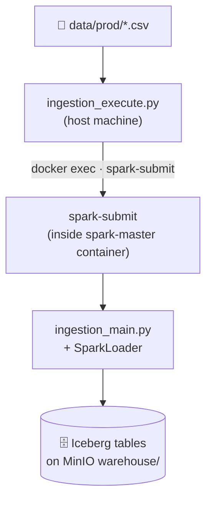

# Ingestion Module

This module is responsible for **Step 1** of the governance pipeline: loading raw CSV data into the Apache Iceberg lakehouse on MinIO using Apache Spark.

---

## 🧱 High-Level Flow



---

## 📂 Module Structure

```text
ingestion/
├── generator.py          # Synthetic data generator (for testing)
├── ingestion_execute.py  # Entry point — builds & submits the spark-submit command
├── ingestion_main.py     # Spark job logic — reads CSVs and writes Iceberg tables
├── spark_loader.py       # SparkLoader class: dynamic ingestion pipeline
└── __init__.py
```

---

## ⚙️ Core Concepts

### Two-Script Design

The ingestion module uses a **two-script pattern** to decouple job submission from job execution:

| Script | Runs On | Responsibility |
| :--- | :--- | :--- |
| `ingestion_execute.py` | Host machine | Builds the `spark-submit` command and invokes it inside the `spark-master` Docker container via `docker exec`. |
| `ingestion_main.py` | Spark cluster (inside container) | The actual PySpark job — reads CSVs and writes to Iceberg. |

### Data Source

The ingestion job reads all CSV files matching the glob pattern configured in `app_config.yml`:

```yaml
spark:
  csv_folder: "/app/data/prod/*.csv"   # ← change this to point to your data directory
```

> ⚠️ The `data/` folder is **not tracked by Git**. You must populate it before running ingestion.

**Required folder structure:**

```
data/
└── prod/
    ├── citizen_info.csv              # The file stem becomes the Iceberg table name
    ├── hr_employees.csv              #   e.g. hr_employees.csv → iceberg.iceberg_data.hr_employees
    ├── medical_records.csv
    ├── administrative_records.csv
    └── metadata/
        ├── citizen_info_metadata.json
        ├── hr_employees_metadata.json
        ├── medical_records_metadata.json
        └── administrative_records_metadata.json
```

- **`<table_name>.csv`** — The source data file. The filename stem (without `.csv`) is used directly as the Iceberg table name.
- **`metadata/<table_name>_metadata.json`** — Ground-truth schema file auto-generated alongside the CSV. It lists every column with its `sensitivity_tag` and `sensitivity_level`, and is used by the test suite for scoring the AI Governance pipeline's accuracy.

**To generate synthetic data automatically**, run the built-in generator from the project root:

```bash
python -m src.modules.ingestion.generator
```

This script (see `generator.py`) generates all four default tables (`citizen_info`, `hr_employees`, `medical_records`, `administrative_records`) along with their `metadata/*.json` files. Use it as a reference for adding new tables with custom column schemas.

### Apache Iceberg on MinIO

Each CSV file is loaded as a separate **Apache Iceberg table** in the `iceberg.iceberg_data` catalog namespace on MinIO. Iceberg provides:
- ACID transactions
- Schema evolution
- Time-travel queries (for future use)

---

## 🚀 Running the Module

### Prerequisites

Ensure the infrastructure stack is running:
```bash
docker compose -f docker_compose_base.yml up -d
```

### Run ingestion (from project root)

```bash
python -m src.modules.ingestion.ingestion_execute
```

To specify a custom CSV folder:

```bash
python -m src.modules.ingestion.ingestion_execute --csv_folder /path/to/your/csvs
```

### What happens

1. `ingestion_execute.py` connects to the `spark-master` container via `docker exec`.
2. It runs `spark-submit` with the configured memory, cores, and Iceberg/S3 packages.
3. Inside Spark, `ingestion_main.py` is executed — it calls `SparkLoader.dynamic_ingestion()`.
4. For each CSV found in the configured folder, a corresponding Iceberg table is created or overwritten on MinIO.

---

## ⚙️ Configuration

All configuration lives in `src/config/app_config.yml`:

```yaml
spark:
  master_container_name: "spark-master"
  master_url: "spark://spark-master:7077"
  executor_memory: "2g"
  driver_memory: "1g"
  executor_cores: 1
  executor_instances: 2
  cores_max: 2
  iceberg_db_name: "iceberg_data"
  csv_folder: "/app/data/prod/*.csv"
```
