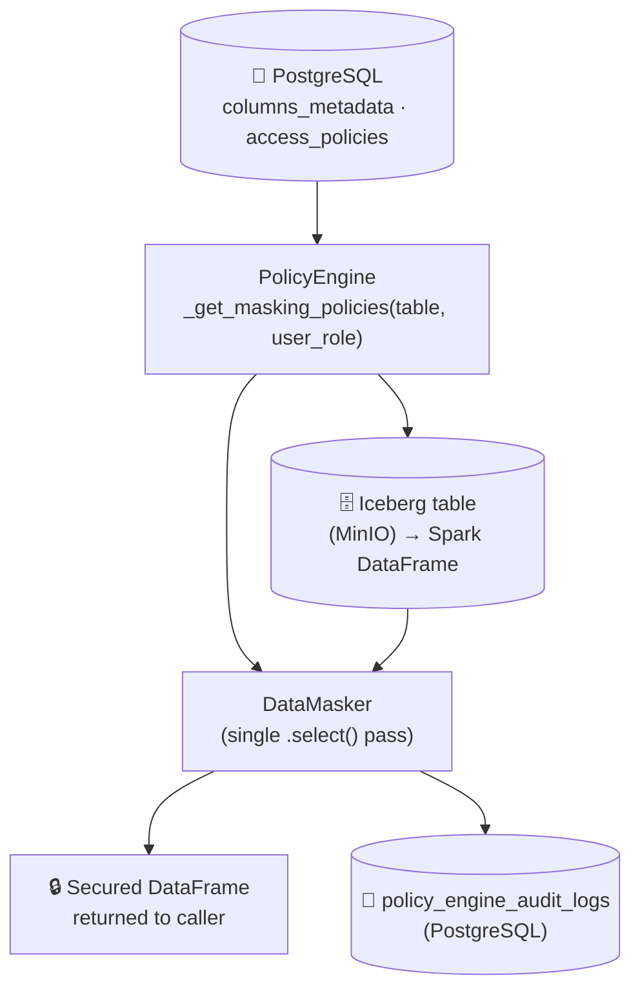

# Policy Engine Module

This module is responsible for **Step 3** of the governance pipeline: reading the PII metadata from PostgreSQL and enforcing **role-based, column-level data masking** on Iceberg tables at query-time.

---

## 🧱 High-Level Flow



---

## 📂 Module Structure

```text
policy_engine/
├── policy_engine_main.py   # Entry point — configures and runs the secure pipeline
├── pipeline.py             # PolicyEngine class: masking policy lookup & application
├── data_masker.py          # DataMasker: Spark column transformation expressions
└── __init__.py
```

---

## ⚙️ Core Concepts

### Role-Based Access Control

The engine enforces masking based on **user roles** (`UserRole` enum):

| Role | Access Level | Example Behaviour |
| :--- | :--- | :--- |
| `ADMIN` | Full clear-text | All columns returned as-is (`CLEAR_TEXT`) |
| `ANALYST` | Partial masking | Phone: `045*****789`, Email: `g******@gmail.com` |
| `AUDITOR` | Strong masking | HIGH fields nullified/redacted, MEDIUM fields hashed |

Masking rules are stored in the `access_policies` PostgreSQL table (keyed by `role_name` × `sensitivity_level`) and loaded at runtime — **no hardcoded rules in application code**.

### Dynamic Masking (`DataMasker`)

Masking is applied in a **single Spark `.select()` pass** across all columns for efficiency. Each column expression is built by `DataMasker.get_masking_expression()`:

| Masking Rule | Behaviour |
| :--- | :--- |
| `HASH_MASK` | SHA-256 hash of the value |
| `PARTIAL_MASK` | Email: `g***@domain.com` / Phone & ID: `045***6789` |
| `REDACTED_MASK` | Replaces value with the literal string `REDACTED` |
| `NULLIFY_MASK` | Sets value to `NULL` |
| `CLEAR_TEXT` | Returns the original value unchanged |

### Audit Logging

Every execution writes a record to `policy_engine_audit_logs` in PostgreSQL containing:
- `user_role`
- `target_table`
- `context_details` (JSON): list of accessed columns, their sensitivity levels, masking actions applied, and whether they were masked.

---

## 🚀 Running the Module

```bash
python -m src.modules.policy_engine.policy_engine_main
```

The `__main__` block in `policy_engine_main.py` is pre-configured as a demonstration:

```python
if __name__ == "__main__":
    test_table = "citizen_info"
    analyst_role = UserRole.AUDITOR

    secure_dfs = policy_engine_main(
        table_name=test_table,
        selected_columns=[],      # Empty = all columns
        user_role=analyst_role
    )

    for df in secure_dfs:
        df.show(truncate=False)
```

Modify `test_table`, `analyst_role`, and `selected_columns` to test different scenarios.

### Available roles

```python
from src.core.dtos.enums import UserRole

UserRole.ADMIN    # Full access
UserRole.ANALYST  # Partial masking
UserRole.AUDITOR  # Strong masking
```

---

## ⚙️ Configuration

The module uses the same `src/config/app_config.yml` as the rest of the system. No module-specific configuration is needed beyond infrastructure connection details (Postgres, MinIO, Spark).
